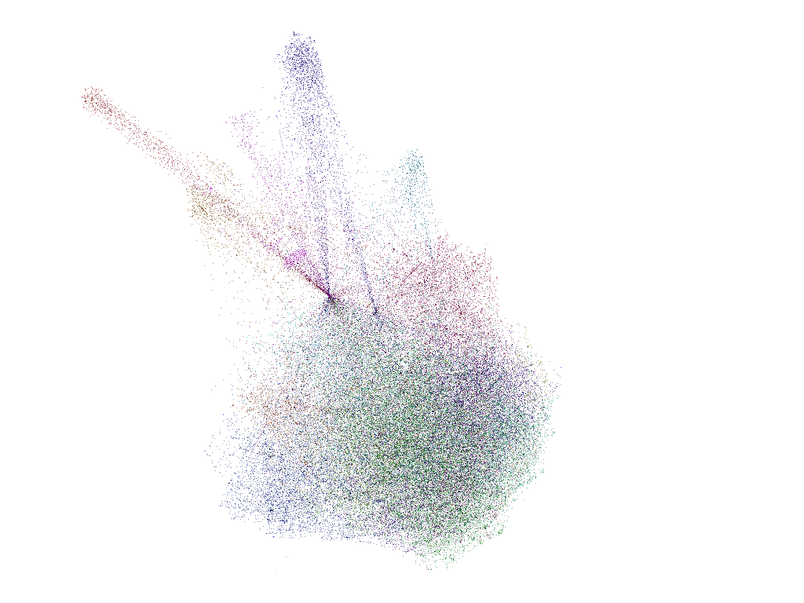

A set of scripts that query the LinkedIn API to retrieve a list of mutual connections for the pair (user, 1st degree connection) for all of the user's first degree connections.

Inspired by this post

[http://dataiku.com/visualizing-your-linkedin-graph-using-gephi-part-1/](http://dataiku.com/visualizing-your-linkedin-graph-using-gephi-part-1/)

and the associated gists from 

[https://gist.github.com/ThomasCabrol](https://gist.github.com/ThomasCabrol)

##Visualised with Gephi

---

MIT License 
